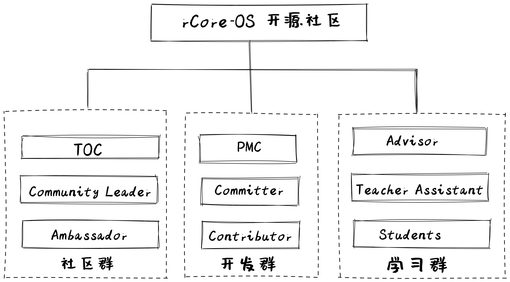

本方案为 rCore-OS 社区试运行方案，有任何建议欢迎与我们交流。

rCore-OS 社区包含面向OS教学的 rCore-Tutorial-v3实验环境、讲义等，以及面向AIoT领域的zCore操作系统内核等各种资源。社区随时都欢迎各种贡献，欢迎提 Issue 或 Pull Request 至社区。

项目地址：

https://github.com/rcore-os/

## 从哪里开始入手？

如果是一位 rCore-OS 新手，建议从以下步骤开始

### 1. 成为 rCore-OS 开源社区开发者

可以选择加入以下群:

微信: XXXX
钉钉: XXXX
QQ: XXXX

### 2. 安装部署 rCore-Tutorial-v3 或 zCore
- rCore-Tutorial-v3 适合于OS入门的新手
- zCore适合于有一定OS经验的老手

### 3. 试运行  rCore-Tutorial-v3 或 zCore

[快速上手]()中提供最简单的基本操作。

### 4. 进阶阶段

## 参与开源共建

欢迎参与 rCore-OS 社区共建，您可以通过以下的步骤参与共建：

### 1. 给自己分配 Issue

首先找到 rCore-OS 社区的 Issue 列表：https://gitee.com/organizations/oceanbase/issues 如果您愿意处理其中的 Issue，您可以将它分配给自己。只需要在评论框内输入 `/assign`，机器人就会将问题分配给您。每个 Issue 下面可能已经有参与者的交流和讨论，如果您感兴趣，也可以在评论框中发表自己的意见参与 Issue 讨论。

### 2. 提交 Issue

如果您准备向社区上报 Bug 或者提交需求，请在 rCore-OS 社区对应的仓库上提交 Issue。您也可以以 Issue 的方式为 rCore-OS 社区贡献自己的意见或建议。

### 3. 提交 Pull Request

提交 Pull Request 请参考 rCore-OS 社区 Pull Request 提交指南。如果一次提交的代码量较大，建议将大型的内容分解成一系列逻辑上较小的内容，分段进行提交会更便于代码检视。如果您的 Pull Request 没有引起足够的关注，可以通过对应的邮件列表求助。

## 参加开源活动

- rCore-OS Meetup：线下高质量的操作系统面基活动，将以每4月一场的频次，在全国各个城市，举行线下技术交流会。
- rCore-OS Broadcast：有趣实用的操作系统设计思考，将以每2月一场的频次，在线上展开直播活动，分享技术干货。

有想要交流的话题或者想要举办的城市，非常欢迎告诉我们

## 社区组织架构

rCore-OS 社区治理架构借鉴 Apache 基金会的运作模式，角色分为：

- 技术委员会（Technical Oversight Committee, TOC）：是 rCore-OS 社区的技术管理机构，负责 rCore-OS 社区相关的技术类重大事件决议。
- PMC（Project Management Committee）：单个项目的项目管理委员会，为项目核心管理团队，参与 Roadmap 和本项目重大决议决策。
- Committer：具有代码提交能力的开发者。
- Contributor：曾做过代码贡献的开发者。
- Advisor：教学/培训导师。
- Teacher Assistant（TA）：教学/培训助教。
- Student：学生。
- Community Leader：社区布道师。
- Ambassador：帮助推广，使用，答疑 rCore-OS的参与者

### TOC（Technical  Oversight  Commitee）

rCore-OS 社区的技术管理机构，负责 rCore-OS 社区相关的技术类重大事件决议。

**职责：**

- 负责社区章程等重大事项，包括审议和修改社区章程等，定义技术相关的常规化实践（原则、流程）；
- 负责社区技术相关的决策，以及项目孵化评审，项目 roadmap 和版本发布审批；
- 审核、批准项目孵化；
- 促进项目间的合作，并负责项目之间的协调，减少冗余与冲突；
- 接受社区参与者的反馈并转达至项目；

**决策机制：**

- 社区每间隔一月举行例会；
- 涉及事项决策的例会，出席人数应达成员二分之一以上方能召开（且其中必须包含主席），就各项决策事项应经出席人数的过半数同意通过；如果决策结果存在平票，主席将对该事项具有一票决策权。
- 会议具体议程和具体参会方式将至少提前三个工作日在社区邮件列表中通知。

**任期&换届：**

- 共设若干名 TOC 席位，初始任期1年

**如何成为 TOC：**

- 由现有 TOC 提名，超过社区2/3 TOC 投票通过，并且无反对票；
- 长期关注项目发展并深度参与社区项目讨论的 PMC，且成为 PMC 至少一年时间；

### PMC（Project Management Commitee）

项目管理委员会，为项目核心管理团队，参与 Roadmap 和重大决议决策，从 committer 中产生

**如何成为 PMC：**

- 超过社区 2/3 PMC 投票通过；
- 长期关注项目发展并深度参与项目讨论的 committer，成为 committer 至少半年时间；

**职责：**

- 积极参与项目讨论，对项目重大决策给予指导；
- 负责保证开源项目的社区活动都能运转良好；

**权利：**

- Pull Request review 权限；
- Pull Request approve 权限；
- Merge 权限；
- 对于项目重大决定的投票权；

**决策机制：**

- 社区每一月举行例会；
- 涉及事项决策的例会，出席人数应达成员二分之一以上方能召开（且其中必须包含主席），就各项决策事项应经出席人数的过半数同意通过；如果决策结果存在平票，主席将对该事项具有一票决策权。
- 会议具体议程和具体参会方式将至少提前三个工作日在社区邮件列表中通知。

### Developer  Group（开发群）

**1. Committer**

具有代码提交能力的开发者.

**如何成为 Committer：**

由已有的 PMC 推荐，并通过2⁄3以上投票通过，满足必须条件以及选择条件中的一个：

必须满足：

- 成为社区成员时间超过三个月；

以下三个条件任意满足一个即可：

- 超过10个 PR 合并；
- 完成至少一个重大功能；
- 修复至少一个严重 Bug；

**职责：**

- 社区咨询支持；
- 积极响应指派给您的 Issue 或 PR；
- Review 社区的 PR；

**权限：**

- Pull Request review 权限；
- Merge 权限；
- 获得 rCore-OSCommitter 勋章；

**2. Contributor**

曾做过代码贡献的开发者。

**如何成为 Contributor：**

- 在 rCore-OS的任何一个正式项目中成功提交一个 PR 并合并。

**职责：**

- 积极响应指派给您的 Issue 或 PR；

**权限：**

- 加入 rCore-OSGitHub/Gitee 组织，成为 rCore-OS开源社区的一员。
- 获得 rCore-OSContributor 小礼物；

### Education Group（教学群）

**1. Advisor**
由已有的 PMC 推荐，参与 rCore-OS相关的教学/培训活动，承担讲师工作。

**2. TA**
由已有的 Advisor 推荐，参与 rCore-OS相关的教学/培训活动，承担助教工作。

**3. Student**
进行 OS相关的教学/培训等学习的学生或工程师等。

### Communtiy  Group（社区群）

**1. Community Leader**

**如何成为 Community Leader：**

由已有的 PMC 推荐，参与 rCore-OS布道，必须满足以下两个以上条件：

- 成为社区成员时间超过4个月，并4个月内保持活跃；
- 原创 rCore-OS相关文章并发布数达到3篇以上；
- 至少代表 OceanBase，参与大会、Meetup 等分享一次；

**职责：**

- 社区咨询支持；
- 积极响应指派给您的文章或分享；
- 对于社区运行规则的投票权；

**权利：**

- 可以对社区运营方向建议以及推进；
- 获得 rCore-OS布道师勋章；

\2. Ambassador

**如何成为 Ambassador：**

以下条件任意满足之一即可

- 原创 rCore-OS相关文章并成功发布一篇以上。
- 在社区活跃超过1个月，并答疑超过30多次。

**职责：**

- 积极响应社区内提问；

**权利：**

- 获得 rCore-OS相关周边。

\3. 社区管理者

**如何成为社区管理者：**

- 只要你对 rCore-OS有热情，愿意为 rCore-OS的布道贡献自己的一份力，一次及以上参与社区线下共建；

**职责：**

- 主导 rCore-OS线上线下活动，包括但不限于 Meetup、Channel 等形式；
- 参与 rCore-OS布道；

**权利：**

- 认证成为 rCore-OS社区管理者，获得相关证书；
- 获得 rCore-OS相关运营周边支持；
- 获得 rCore-OS运营以及内容支持；

## 联系我们

QQ：

微信：

## 社区当前组织

### TOC

Chairman  向勇

Member   陈渝

Member  王润基

**联系方式：**  toc@...

### rCore Tutorial 

PMC(Chairman)  陈渝

PMC 吴一凡

Committer 许善朴

**联系方式：**toc@...

### zCore

PMC(Chairman) 陈渝

PMC 肖络元

PMC 王润基

Committer 杨德睿

Committer 石振兴

Committer 董峰

Committer 陈乐

Committer 张译仁

**联系方式：**toc@...

### Docs

PMC(Chairman) 肖络元

Committer 石振兴

Committer 杨德睿

Committer 石振兴

Committer 董峰

Committer 陈乐

**联系方式：**toc@...

### Test

PMC(Chairman) 石振兴

PMC 肖络元

Committer 杨德睿

Committer 石振兴

Committer 董峰

Committer 陈乐

**联系方式：**toc@...